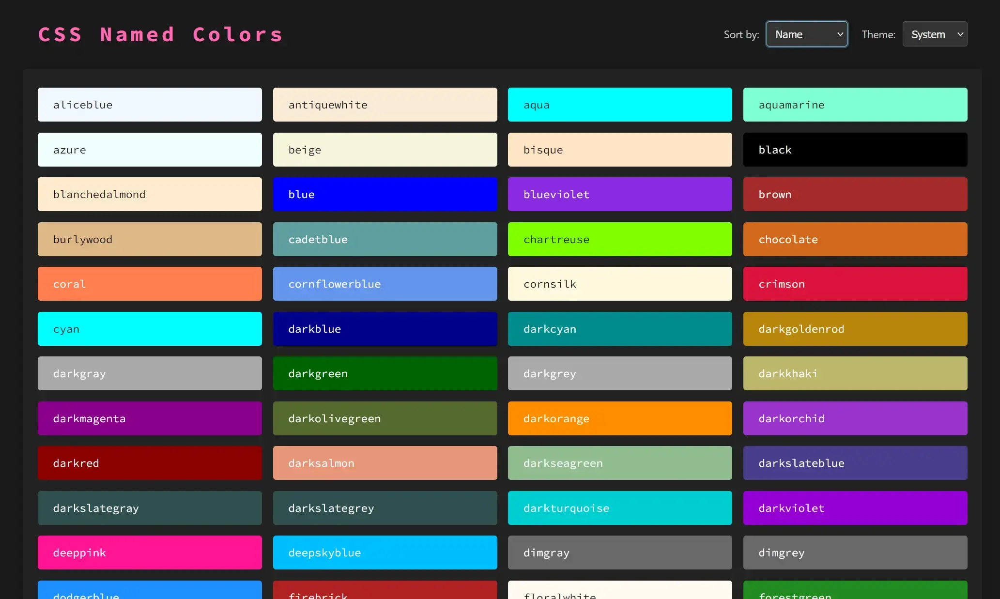

# CSS Named Colors

An interactive list of all W3C named CSS colors. Each color is displayed as a swatch which can be clicked to copy its name or hex value.

**Go to [CSS Named Colors](https://dcog989.github.io/CSS-Named-Colors/)**.

## Features

- Displays all W3C named CSS colors.
- Color swatch next to each name.
- Dark or light theme switch.
- SVG copy icon appears on swatch when hovering over a color item.
- Click any part of a color swatch to copy its name.
- Uses `GoatColorToolbox.js` for the definitive list of named colors and for luminance calculations to ensure icon visibility.
- Responsive grid layout for color items.
- Visual "Copied!" notification.
- Includes a custom SVG favicon (palette icon).
- Sort colors by name, hue, or luminosity

## Tech Stack

- HTML
- CSS (Grid, Flexbox)
- JavaScript (DOM manipulation, Clipboard API)
- [GoatColorToolbox.js](js/GoatColorToolbox.js) (included)
- SVG (for icons)

## Usage

1. Clone this repository or download the files.
2. Ensure `GoatColorToolbox.js` and the main HTML file (e.g., `colors_with_toolbox.html`) are in the same directory.
3. Open the HTML file in any modern web browser.

## Files

- `colors_with_toolbox.html` (or your chosen HTML filename): The main webpage.
- `GoatColorToolbox.js`: The color utility library.
- `favicon.svg`: The SVG favicon for the page.
